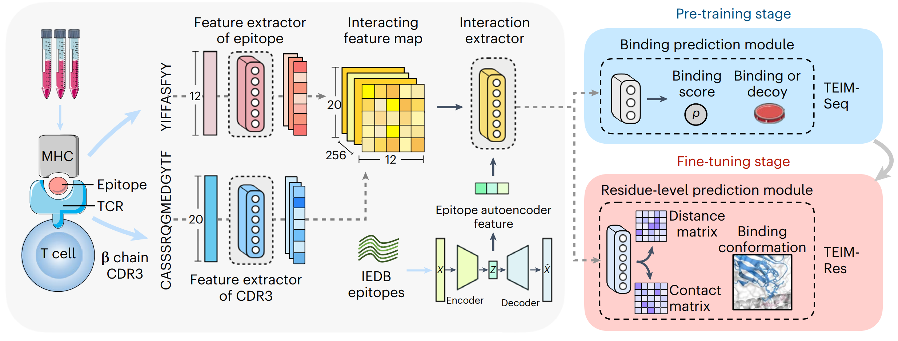

# TEIM: *TCR-Epitope Interaction Modeling*
This repository contains the codes for the paper [TEIM: Characterizing the interaction conformation between T-cell receptors and epitopes with deep learning](https://www.nature.com/articles/s42256-023-00634-4) published in Nature Machine Intelligence.



TEIM (**T**CR-**E**pitope **I**nteraction **M**odeling) is a deep learning-based model to predict the TCR-epitope interactions, including two submodels TEIM-Res (TEIM at **Res**idue level) and TEIM-Samp (TEIM at **Seq**uence level). 

Both models only takes the primary sequences of CDR3βs and the epitopes as input. **TEIM-Res** predicts the distances and the contact probabilities between all residue pairs of CDR3βs and epitopes. **TEIM-Seq** predicts whether the CDR3βs and epitopes can bind to each other.

## Dependency
0. Install Python>=3.8 and Anaconda.
1. Install basic packages using:
    ```bash
    # [Optional] Create a new environment and activate it
    conda create -n teim python=3.8
    conda activate teim

    # Install Pytorch packages (for CUDA 11.3)
    conda install pytorch==1.10.1 cudatoolkit=11.3 -c pytorch -c conda-forge
    # Install other packages
    pip install -r requirements.txt
    ```
    **Note**: Change the Pytorch version to be compatible with your CUDA version. Besides, since the Pytorch Lightning version we used is 1.6.4, the compatible Pytorch version is $>=1.8,<=1.11$ (see [here](https://lightning.ai/docs/pytorch/stable/versioning.html)).
2. Install [ANARCI](https://anaconda.org/bioconda/anarci) for CDR3 numbering.
    ```bash
    conda install -c bioconda anarci
    ```
We also provided a docker file to facilitate the installation of environment. You can build the docker by runing
```bash
docker build -t teim:v1 .
```

## Inference
### Predict the residue-level interactions of TCR-epitope pairs
1. Put your input TCR-epitope sequence pairs in the `inputs/inputs.csv` file. The TCRs are represented by their CDR3β sequences and the epitopes are represented by their sequences in the following format:
    | cdr3             | epitope   |
    | ---------------- | --------- |
    | CASAPGLAGGRPEQYF | LLFGYPVYV |
    | CASRGAAGGRPQYF   | MLWGYLQYV |
    | CASRPGLAGGRAEQYF | FTDSSVWA  |

2. Run 
    ```
    python scripts/inference_res.py
    ```
3. The predicted distance matrices and contact site matrices are in the `outputs` directory: 
    - The predicted distance matrix and contact matrix are in the files names as `dist_<cdr3>_<epitope>.csv` and `site_<cdr3>_<epitope>.csv`, respectively. 
    - The rows and columns of the matrices represent the CDR3βs and epitopes, respectively.
    - The values in the distance matrix stand for the distances of residue pairs (unit: angstrom) and the values in the contact matrix stand for the predicted contact scores (probabilities) of residue pairs (range from 0 to 1). 


### Predict the seqence-level interactions of TCR-epitope pairs
1. Put your input TCR-epitope sequence pairs in the `inputs/inputs_bd.csv` file. The format is the same as `inputs/inputs.csv` (residue-level input file).
2. Run 
    ```
    python scripts/inference_seq.py
    ```
3. The predicted sequence-level binding scores are in the `outputs/sequence_level_binding.csv`. The `binding` column in the file represent the predicted sequence-level binding scores (probabilities) of the TCR-epitope pair.


## Training
Please refer to the directory [`train_teim`](./train_teim/).

## Citation
```bibtex
@article{Peng2023,
  doi = {10.1038/s42256-023-00634-4},
  url = {https://doi.org/10.1038/s42256-023-00634-4},
  year = {2023},
  month = mar,
  publisher = {Springer Science and Business Media {LLC}},
  volume = {5},
  number = {4},
  pages = {395--407},
  author = {Xingang Peng and Yipin Lei and Peiyuan Feng and Lemei Jia and Jianzhu Ma and Dan Zhao and Jianyang Zeng},
  title = {Characterizing the interaction conformation between T-cell receptors and epitopes with deep learning},
  journal = {Nature Machine Intelligence}
}
``````
## Contact
If you have any questions, please contact us at xingang.peng@gmail.com
